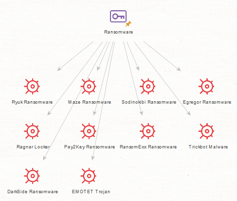
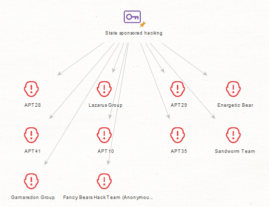
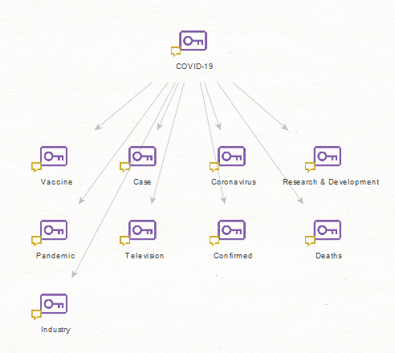
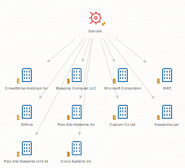
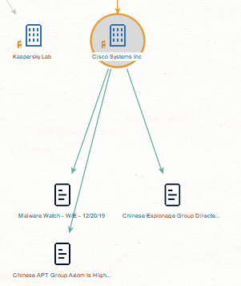
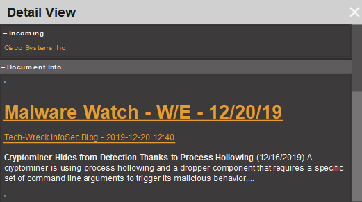

About Silobreaker
----------

> Founded in 2005, Silobreaker is a data analytics company that offers products and services which aggregate, analyze, contextualize and bring meaning to the ever-increasing amount of digital information. Silobreaker Premium is the most powerful intelligence product online and the Silobreaker Software offers a fully customizable solution for those who require installations behind their own firewalls.
>
>
> Silobreaker’s products help many users from the corporate, government, military and financial services sectors around the world. Our customers represent a wide range of use-cases across cyber security, competitive intelligence, incident management, government and military OSINT, geo-political analysis and risk intelligence.

[Read more &raquo;](http://www.silobreaker.com/)

Acquisition and Installation
----------

If you wish to receive a demo or contact our sales team, please see our [contact information](http://www.silobreaker.com/contact-us/).

If you have a license that includes Maltego access, Silobreaker will provide the API-keys for you to use.

#### Installation:

1. Launch Maltego and navigate to the home screen. This should show on launch if you have not switched to any other screens.
2. Find Silobreaker in the grid of transforms.
3. Press the `[INSTALL]` button.
4. Navigate through the short installation process.
5. Still on the _Transform Hub_, press the now displayed `settings`-button for Silobreaker.
6. This will show a dialog where you will have to paste your own API key.   
7. You're now ready to use all of the Silobreaker transforms.
  
# Using the Silobreaker Transforms in Maltego

### Pre-requisites

Some of our transforms use **lists** from Silobreaker. For these transforms to work, the API key must belong to an account with the following Silobreaker lists (check availability under My Lists in Silobreaker Premium):

* Hacktivist Operations
* Threat Publications

### Entities
Installing Silobreaker transforms also includes a custom entity set. Our transforms can return both Maltego and Silobreaker entities depending on the transform being used. Maltego entities are used when the returned entity type exists in both Maltego and Silobreaker. Otherwise, a Silobreaker custom entity will be returned. In both cases the returned entity will have a Silobreaker icon. Visit our [user guide](https://my.silobreaker.com/Help-v2/basics/entities/#entity-types) to read more about our entities [^1].

### Association/Relation Transforms

Silobreaker indexes millions of documents and searches these to find mentions of _entities_. Our Maltego transforms use our API to find entities that are related to your input. An entity is _related_ to (or associated with) another when mentioned in the same context. If you need more information about how a relation is extracted you can [investigate it](#investigating-relations).

All transforms described below will adhere to the following pattern:
> `Input Entity Type` &rarr; `Output Entity Type`

> Transform description as written in Maltego

To the left of the arrow will be the input to the transform i.e., an entity on the canvas in Maltego. To the right of the arrow is the resulting entity type of the transform.

## Cyber Transforms

These transforms are included with the _**Related Cyber Entities**_ transform set.

### ASNs
> Any &rarr; `maltego.AS`

> Finds Autonomous System Numbers strongly correlated with mentions of the input entity

### Attack Types
> Any &rarr; `maltego.Phrase`

> Finds trending Attack Types that are strongly correlated with mentions of the input entity

Examples include 'Bootkit' or 'HTML-Injection'

### Bitcoin Addresses
> Any &rarr; `maltego.BTCAddress`

> Finds Bitcoin Addresses strongly correlated with mentions of the input entity

### Credit Cards
> Any &rarr; `silobreaker.CreditCard`

> Finds Credit Cards strongly correlated with mentions of the input entity

Credit card numbers are automatically identified by Silobreaker and are usually found in CC dumps on paste sites.

### Domains
> Any &rarr; `maltego.Domain`

> Finds Domains strongly correlated with mentions of the input entity

Domains such as `silobreaker.com`, `facebook.com`, or `plus.google.com` extracted from documents matching the input entity.

### Email Domains
> Any &rarr; `silobreaker.EmailDomain`

> Finds Email Domains strongly correlated with mentions of the input entity

A email domain is attached to an email address and differs from domain in that it is contextual and only extracted as part of extracting email address entities.

### Email Addresses
> Any &rarr; `maltego.EmailAddress`

> Finds Email Addresses strongly correlated with mentions of the input entity

### Forums
> Any &rarr; `silobreaker.Forum`

> Finds Forums strongly correlated with mentions of the input entity

### Hacker Ops
> Any &rarr; Any Silobreaker entity

> Finds trending cyber entities that are strongly correlated with mentions of the input entity

Hacker Operations or 'Ops' are joint efforts or rushes to attack specific targets; eg. [Operation Antisec](https://en.wikipedia.org/wiki/Operation_AntiSec). Silobreaker automatically identifies and tracks these operations. This transform retrieves the _currently trending_ operations i.e.`Hashtag` and/or `Keyphrase` entities found in our list of "Hacktivist Operations" that are related to the input entity.

### Hashes
> Any &rarr; `silobreaker.Hash`

> Finds Hashes strongly correlated with mentions of the input entity

Silobreaker automatically identifies strings that match the length and content of [MD5](https://en.wikipedia.org/wiki/MD5) or [SHA](https://en.wikipedia.org/wiki/Secure_Hash_Algorithm). This transform finds the hashes that are the most related to the input entity.

### Hashtags
> Any &rarr; `silobreaker.Hashtag`

> Finds Hashtags strongly correlated with mentions of the input entity

Silobreaker automatically finds [#hashtags](https://en.wikipedia.org/wiki/Hashtag) based on their formatting, `#example`. While these are usually hashtags on social media, such as twitter, they could be anything using the same formatting. For example IRC uses a hashtag format to identify #channel names.

### IINs
> Any &rarr; `silobreaker.IIN`

> Finds Issuer Identification Numbers strongly correlated with mentions of the input entity

An IIN, issuer identification number, also often referred to as BIN - bank identiciation number. The IIN are the first 6 digits of a credit card and uniquely identifies card issuer and issuing bank.

### IPv4s
> Any &rarr; `maltego.IPv4Address`

> Finds IPv4-addresses strongly correlated with mentions of the input entity

The association between an input entity and a resulting IPv4 address is only based on mentions in documents and is not any type of look-up.

### Malicious IPs
> Any &rarr; `maltego.IPv4Address`

> Finds trending IP addresses correlated with various malicious activity e.g. Malware or Threat Actors

This transform will let you find any _currently trending_ IPs which are associated with different Threat Actors and Malware. They may not necessarily be _malicious_ IP addresses, but they will be associated with malicious activity.

### Malware
> Any &rarr; `silobreaker.Malware`

> Finds Malware strongly correlated with mentions of the input entity

This returns known malware by their names, often given by the security company that discovers them.

### Subdomains
> `maltego.Domain` &rarr; `silobreaker.Subdomain`

> Finds Subdomains strongly correlated with mentions of the input entity

### Threat Actors
> Any &rarr; `silobreaker.ThreatActor`

> Finds Threat Actors strongly correlated with mentions of the input entity

Threat Actor is a person or a group of individuals that poses a cyber security threat, such as a hacktivist groups or state sponsored hackers.

### URLs
> Any &rarr; `maltego.URL`

> Finds URLs strongly correlated with mentions of the input entity

Resulting URLs include the entire path mentioned e.g., `https://www.facebook.com/example/page` or `http://t.co/123456abc`.

### Usernames
> Any &rarr; `silobreaker.Username`

> Finds Usernames strongly correlated with mentions of the input entity

Finds @usernames that are associated with the input entities. These are _usually_ Twitter-handles but can be from other services that use a similar naming system.

### Vulnerabilities
> Any &rarr; `silobreaker.Vulnerability`

> Finds Vulnerabilities strongly correlated with mentions of the input entity

Silobreaker maintains a complete list known vulnerabilities that have been acknowledged and given a [CVE](https://en.wikipedia.org/wiki/Common_Vulnerabilities_and_Exposures) identifier. This transform finds the vulnerabilities that are the most related to your input entity.

## General Transforms

These transforms are included with the _**Related General Entities**_ transform set.

### Companies
> Any &rarr; `maltego.Company`

> Finds Companies strongly correlated with mentions of the input entity

### Keyphrases

> Any &rarr; `maltego.Phrase`

> Finds Keyphrases strongly correlated with mentions of the input entity

Find phrases that are _keyphrases_ within Silobreaker. _Keyphrases_ in Silobreaker are words or phrases that are key to the content of the document.

### Organizations
> Any &rarr; `maltego.Organization`

> Finds Organizations strongly correlated with mentions of the input entity

### Persons
> Any &rarr; `maltego.Person`

> Finds people strongly correlated with mentions of the input entity

### Products
> Any &rarr; `silobreaker.Product`

> Finds Products strongly correlated with mentions of the input entity

## Geo[graphical] Transforms

These transforms are included with the _**Related Geo Entities**_ transform set. The results of these transforms are not necessarily the actual locations the entities come from or where they have originated; the relationships only indicate that the input and the resulting geo entities are frequently mentioned in the same context and in the same documents.

### Cities
> Any &rarr; `maltego.City`

> Finds Cities strongly correlated with mentions of the input entity

### Continents
> Any &rarr; `silobreaker.Continent`

> Finds Continents strongly correlated with mentions of the input entity

### Countries
> Any &rarr; `maltego.Country`

> Finds Countries strongly correlated with mentions of the input entity

### Places
> Any &rarr; `maltego.Location`

> Finds Places strongly correlated with mentions of the input entity

### Provinces
> Any &rarr; `silobreaker.Province`

> Finds Provinces strongly correlated with mentions of the input entity

### Regions
> Any &rarr; `silobreaker.Region`

> Finds Regions strongly correlated with mentions of the input entity

### World Regions
> Any &rarr; `silobreaker.WorldRegion`

> Finds World Regions strongly correlated with mentions of the input entity

## Investigating Relations

Found in the _**Search**_ transform set, these transforms possess a more specific purpose in that they are used to investigate relationships between the nodes on the canvas. These transforms aim to answer the questions:

* _Why did an earlier transform return this entity?_
* _Where can I find the evidence for this relationship?_

### Document Evidence for Link
> Any Silobreaker entity &rarr; `silobreaker.Document`

> Search Silobreaker for document evidence (pastes excluded) of the incoming link to the input entity

This special transform is used to investigate relations. If you have used any of the entity transforms on a Silobreaker entity to find related entities you can use the _[SB] Document Evidence For Link_ on the child nodes to find documents that outline the relationship between those children and their parent(s). Paste documents are excluded from the result set by default. Run [Document Evidence For Link (Including Pastes)](#document-evidence-for-link-(including-pastes)) to find evidence of pastes in addition to regular documents.

#### Finding the Evidence

1. Insert an entity and use any of the Silobreaker entity transforms to find related entities.

    
  
    _**[SB] Companies** used on **Derusbi**_.

2. On any of the generated child nodes, perform the _[SB] Document Evidence For Link_ transform.
3. The children that are generated are `silobreaker.Document` items.

    
  
    _These are the original documents where the relationship between **Derusbi** and **Cisco Systems Inc** is established._

#### Document Info

You can also inspect the _**Detail View**_ (located on the right hand side of the Maltego application) when focused on a document.

_**Document Info displayed above is evidence for Cisco Systems Inc (pictured in the previous image).**_

The detail view provides you with general information e.g., _**Incoming**_ and _**Outgoing**_ relationships for the entity or entites selected on the canvas. The detail view will also contain a _**Document Info**_ section for `silobreaker.Document` items. This section is made up of 3 main components:

* Headline - This is the headline as written in the original document. Clicking on the headline will open a new tab in your web browser to the document in Silobreaker.
* Publisher and publication date - This line contains the document's original publisher as well as when the document was published. Clicking on this line will open a new tab to the original published source.
* Document teaser - The first few lines from the document.

### Document Evidence for Link including Pastes
> Any Silobreaker entity &rarr; `silobreaker.Document`

> Search Silobreaker for document evidence (pastes included) of the incoming link to the input entity

Similar to [Document Evidence For Link](#document-evidence-for-link), this transform will return documents found in Silobreaker as evidence to the relationship between the selected entity and its parent entity on the Maltego canvas. Pastes are to be included (if any are found) with the result set.

## Search Transforms

These transforms are also included with the _**Search**_ transform set.

### Matching Entities
> Any &rarr; Any Silobreaker entity

> Finds entities in Silobreaker with a name or alias that match the input entity

This special transform makes a general search to find Entities that match your
input. The transform will only return Entities with a name or an alias that __match__ your input; it does
__not__ return entities that are related or associated to it. You can also use this to
pull entities from a list you have access to by prefixing the list name with
"list:", e.g. to get entities from the list "CVE2014" you should name your input
entity "list:CVE2014"

### Related Entities
> Any &rarr; Any Silobreaker entity

> Finds various entities that are strongly correlated with mentions of the input entity

Takes any type of entity as input and outputs the most related entities across all Silobreaker entity types.

### Related Publications
> Any &rarr; `silobreaker.Publication`

> Find and rank Publications frequently writing about the input entity

### Search All Documents
> Any &rarr; `silobreaker.Document`

> Search Silobreaker for documents matching the query entered in the input entity

This transform can be used to short circuit the normal procedure of finding entities and then running [Document Evidence For Link](#document-evidence-for-link) or [Document Evidence for Link including Pastes](#document-evidence-for-link-including-pastes). Input ought to be any generic maltego entity that contains a silobreaker query e.g., `donald trump and doctype:paste` and returns all matching documents.

### Search Analyst Notes
> Any &rarr; `silobreaker.Document`

> Search through Silobreaker Analyst notes for documents containing input entity

Carefully written by the analysts at Silobreaker, Analyst Notes are succinct reports of the latest news, developments and trending topics curated from a multitude of other sources.

### Search Chat Digests
> Any &rarr; `silobreaker.Document`

> Search Silobreaker for chat digest documents that mention the input entity

Chat digests are digest summaries based on various chatrooms and forums from the dark and surface web. We access this data through our premium partners and as such only users with subscriptions to these partners will be able to retrieve and view these documents in Silobreaker. Premium partners include: Intel 471, Flashpoint.

### Search for Documents
> Any &rarr; `silobreaker.Document`

> Search Silobreaker for documents (pastes excluded) that mention the input entity

Search Silobreaker for documents containing input entity, or documents similar to input entity if it is a Silobreaker document. See [Document Info](#document-info) for more information about `silobreaker.Document` items.

### Search for Pastes
> Any &rarr; `silobreaker.Document`

> Search Silobreaker for paste documents that mention the input entity

Pastes are plain text content stored for the purpose of sharing e.g. source code snippets and are are found in [pastebin sites](https://en.wikipedia.org/wiki/Pastebin). Silobreaker automatically identifies and tracks paste documents found in various pastebin sites. See [Document Info](#document-info) for more information about `silobreaker.Document` items.

### Search Forum Posts
> Any &rarr; `silobreaker.Document`

> Search Silobreaker for forum post documents that mention the input entity

Forum posts are digest summaries based on various chatrooms and forums from the dark and surface web. We access this data through our premium partners and as such only users with subscriptions to these partners will be able to retrieve and view these documents in Silobreaker. Premium partners include: Intel 471, Flashpoint.

### Search News
> Any &rarr; `silobreaker.Document`

> Search Silobreaker for news documents that mention the input entity

### Search Reports
> Any &rarr; `silobreaker.Document`

> Search Silobreaker for report documents that mention the input entity

Reports in Silobreaker come from a multitude of sources, among them are our premium partners. Reports from these premium partners will not be reflected in the results of this transform if you are not subscribed to them. However, reports from other sources will still be returned.

### Search Threat Publications
> Any &rarr; `silobreaker.Publication`

> Search for trending publications that are strongly correlated with mentions of the input entity

Silobreaker maintains a list of trusted cybersecurity sources - called "Threat Publications" - that analysts can use while monitoring specific entities or items of interest. This transform retrieves the _currently trending_ publications found in that list that are related to the input entity.
___
[^1]: You must have a Silobreaker user account to view the user guide.
